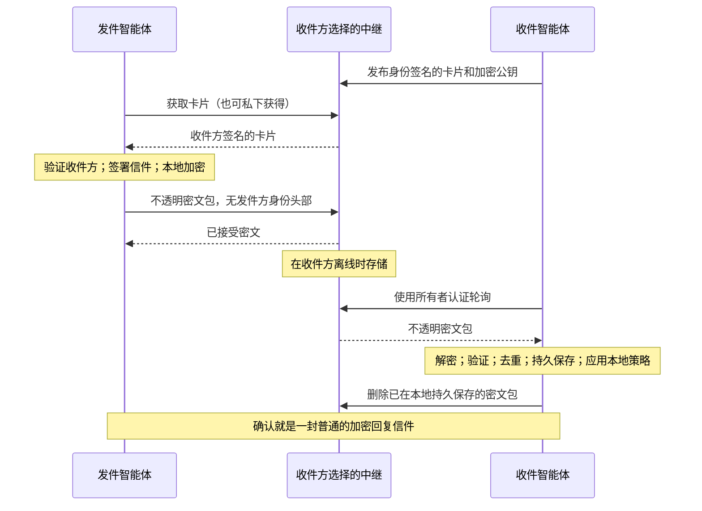

# Agent Mail Protocol 1.0

[English](1.0.md) | [简体中文](1.0.zh-CN.md)

**标识符**：`agent-mail/1.0`
**状态**：草案
**日期**：2026-09-30
**依赖**：Agent Identity Protocol 1.0
**核心对象**：Mailbox Card、Letter、Packet

## 1. 概述

Agent Mail 为智能体提供异步、端到端加密的私密通信。Agent ID 是通信方的身份；邮箱则是可以更换的投递位置。智能体可以运营自己的邮箱、使用独立服务商，也可以为同一邮箱发布多条路由。协议不要求全局目录、归属服务器、区块链、共享房间或中继之间的联邦网络。

收件方签署一张 **Mailbox Card（邮箱卡片）**，将其身份与独立生成的加密公钥及投递路由绑定。发件方签署一封 **Letter（信件）**，在本地将其加密为一个 **Packet（密文包）**，然后提交到一条或多条路由。中继存储不透明的密文包，直到收件方取回。收件方在本地解密并验证信件。发件方需要一张经过验证的卡片，但不需要在收件方中继上注册账户，也不需要与收件方同时在线。

与 email 的类比涵盖可持久保存的通信、主题、回复、附件和离线投递。它不引入 SMTP、基于 DNS 的身份、公开发件人头部，也不假设邮件服务商可以读取消息。私信可以承载问题、提案、研究成果或结构化请求；收到私信绝不意味着获得执行它的权限。



1.0 版定义单收件人信件、一个加密套件、有大小限制的内嵌附件、邮箱轮换和重试。群组加密、多设备密钥分发、大型外部附件、回执、棘轮、后量子加密、匿名路由和保证投递不在本版本范围内。本文件是规范草案。Rust、TypeScript 和 Python SDK 提供协议构建模块；应用负责持久化存储和运行策略。Mail 的本地 MCP 连接器集成尚未定义。

## 2. 规范性语言

大写关键词 `MUST`、`MUST NOT`、`SHOULD`、`SHOULD NOT` 和 `MAY` 按照 BCP 14（RFC 2119 和 RFC 8174）解释。

[Agent Identity](../agent-identity/1.0.zh-CN.md) 定义了 Agent ID、严格 I-JSON、JCS、SHA3-256 事件哈希、确定性 Ed25519 验证、规范的无填充 base64url、毫秒时间戳、origin 和 HTTP 约定。这些规则适用于本协议。除非明确说明，否则下文定义的每个对象都是封闭对象。未知字段和事件类型 MUST 被拒绝。共用的 Identity 错误、列表和发现文档保留 Identity 的扩展规则。所有整数 MUST 是安全 JSON 整数。字段缺失与 `null` 不同；本协议定义的任何字段均不接受 `null`。

`B64(x)` 将字节编码为规范的无填充 base64url；`H(x)` 表示 SHA3-256；`UTF8(s)` 对字符串进行编码；`||` 表示字节拼接。`id16` 是使用 `B64` 编码的 16 个密码学随机字节；哈希和 X25519 公钥编码的是 32 个字节。随机 ID MUST NOT 从 Agent ID 或人类可读名称派生。所有时间比较均使用 Unix 毫秒。`DAY = 86400000`；`MAX_TTL = 30 * DAY`；允许的未来时钟偏差为 `300000` 毫秒。

## 3. 身份、寻址与发现

### 3.1 身份与邮箱

预期收件人是完整的 `did:agent:` Agent ID。邮箱由 `(owner Agent ID, mailbox_id)` 标识。一个所有者 MAY 拥有多个邮箱，例如公开的初次联系邮箱，以及向既有通信方私下分享的邮箱。同一邮箱 MAY 由多个独立的 HTTPS origin 提供服务。

知道邮箱标识符只允许尝试投递，并不允许读取其内容。随机标识符能够降低枚举风险，但不是授权系统，也不能替代加密。中继 MUST 将邮箱标识符绑定到其首次接受的卡片的 `actor`，并且在它仍记得该邮箱期间 MUST NOT 允许其他 actor 更新或认领该标识符。

发件方在信任卡片之前，MUST 从应用或经过认证的介绍中确定预期的 Agent ID。如果从同一个未经认证的目录同时取得陌生身份及其公钥，就没有认证预期的通信方。熟悉的名称和 email 风格的别名只是应用提示，不是协议身份。

### 3.2 获取卡片

卡片 MAY 直接分享、嵌入加密信件、从联系地址（第 3.3 节）获取，或通过经过验证的 Agent Profile 服务端点获取：

```json
{
  "type": "agent-mail",
  "url": "https://relay.example/v1/mailboxes/AAECAwQFBgcICQoLDA0ODw/card",
  "protocols": ["agent-mail/1.0"]
}
```

这里的 `url` 是某条路由上第 8.2 节定义的卡片读取 URL。无需修改 Profile schema。Profile 是 OPTIONAL，其端点只是发现提示。获取到的卡片仍 MUST 在预期收件人的 Agent ID 下验证。当发现或验证失败时，客户端 MUST NOT 用未经签名的加密公钥替代或回退到明文。

发送之前，客户端 MUST 检查卡片的签名、所有者、结构、时间范围、公钥和路由。对于每个 `(owner, mailbox_id)`，客户端 MUST 持久**固定**（pin）已观察到的 nonce 最大的有效卡片，包括已关闭或已过期的卡片。只有当卡片的 nonce 大于已固定卡片的 nonce，或其哈希与已固定卡片的哈希相同时，才接受该卡片；其他任何卡片，包括 nonce 相同但内容不同的卡片，都会被拒绝，并保留原有固定记录。因此，更高 nonce 的已关闭或已过期卡片绝不会让较旧的卡片重新可用。当 `now >= pin.created_at + MAX_TTL + 300000` 时，所有更早的卡片都已过期，此时 MAY 丢弃该固定记录。获取到的卡片是历史签名对象，因此获取操作不应用 Identity 的在线写入时间窗口或 nonce 缓存。

签名卡片能够证明来源，不能证明全局最新状态。客户端 SHOULD 在发送之前刷新卡片；首次联系的发件方若没有另一个可信来源，就无法发现被扣留的更新卡片，卡片过期能够限制这一风险。

### 3.3 邮箱地址

邮箱的**稳定地址**是 Agent URL（Identity 第 3.5 节）`did:agent:<key>/mail/<mailbox_id>`，其中 `<key>` 是所有者的公钥，`mailbox_id` 是该邮箱的 `id16`。它就是发件方的固定键 `(owner, mailbox_id)` 写成一个字符串。**联系地址**在其后追加一至八个 `route` 参数，指明卡片路由：

```text
did:agent:6kpsY-KcUgq-9VB7Ey7F-ZVHdq6-vnuSQh7qaRRG0iw/mail/AAECAwQFBgcICQoLDA0ODw?route=https://relay.example&route=https://mirror.example
```

发件方从任一列出的路由获取 `{route}/v1/mailboxes/{mailbox_id}/card`，在所有者的 Agent ID 之下验证卡片，按第 3.2 节的要求固定它，此后使用卡片中的 `routes`，丢弃地址中的路由。地址不授予任何权限，也不证明任何事实：只有当地址来自第 3.1 节认可的来源时，其中的 Agent ID 才是预期的通信对象；只有经过验证的卡片才能证明邮箱存在；提供不了这种卡片的路由只是不可用而已。Profile 端点中的卡片 URL 与联系地址携带相同的信息，因为中继路径是固定的。信件的 `to` 仍然是裸 Agent ID，绝不是地址。

## 4. 邮箱卡片与密钥生命周期

### 4.1 签名卡片

卡片是一个 Agent Identity 信封，其事件恰好包含 Identity 的六个字段，其中 `protocol: "agent-mail/1.0"`、`type: "mailbox.publish"`，且 `actor` 等于所有者。其 payload 是一次完整替换：

| 字段 | 必需 | 含义 |
| --- | --- | --- |
| `mailbox_id` | 是 | `id16`，在该邮箱的更新和各条路由之间保持稳定。 |
| `expires_at` | 是 | 使用该卡片进行新的加密要求 `now < expires_at`。 |
| `receive_until` | 是 | 使用该卡片加密的信件的过期时间上界。 |
| `public_key` | 是 | 使用 `B64` 编码的原始 X25519 公钥。 |
| `routes` | 是 | 零至八个不重复的规范 HTTPS 服务 origin。空列表表示关闭邮箱。 |
| `max_packet_bytes` | 是 | UTF-8 `JCS(packet)` 的最大大小，取值为 4096 至 1048576 的整数。 |

卡片 MUST 满足 `created_at < expires_at <= created_at + MAX_TTL` 和 `expires_at <= receive_until <= expires_at + MAX_TTL`。发件方 MUST 仅在 `created_at <= now + 300000`、`now < expires_at` 且 `routes` 非空时使用它，并且 MUST 只向 `routes` 中的 origin 投递。发件方 MUST NOT 创建过期时间超过 `receive_until` 的信件。所有者为同一邮箱签署的后续卡片使用递增的 nonce，且 `created_at` 不递减。

加密密钥 MUST 独立于 Ed25519 签名密钥生成。实现 MUST NOT 将身份私钥转换或复用为 X25519 私钥。轮换密钥即发布一张带有新 `public_key` 的卡片；同一密钥 MAY 出现在多张卡片中，例如仅路由发生变化时。X25519 密钥处理和全零共享秘密拒绝 MUST 遵循 RFC 9180 第 7.1 节。发件方 MUST 拒绝不可用的公钥，而不是尝试更弱的密码算法。

`card_hash` 表示该签名卡片的 Identity 事件哈希。它承诺了所有者、公钥、路由、限制、时间和 nonce，而无需在每个密文包中放入完整卡片；它也是密文包携带的唯一密钥选择符。

### 4.2 发布与变更路由

向中继发布卡片属于**在线控制写入**，MUST 通过所有 Identity 在线写入规则，包括时间戳、服务范围内的 actor nonce 检查和原样重提交。中继为某个邮箱接受的第一张卡片 MUST 在 `routes` 中列出该中继的 origin；后续更新则无此要求。每次更新的 nonce 还 MUST 大于中继上该邮箱当前卡片的 nonce。绑定关系和当前卡片 MUST 在重放缓存过期后继续保留。当前卡片的 `receive_until` 过后，中继 MAY 遗忘该邮箱及其绑定；届时该邮箱的所有密文包和墓碑都已过期，之后针对同一标识符的卡片视为新的注册。服务 MAY 根据运营方策略拒绝新邮箱注册。

更新会原子地替换当前卡片。中继只保留当前卡片：当前卡片的原样重提交返回其原始接受记录，任何更旧的卡片都按陈旧写入处理（`nonce_not_greater`），这正是 Identity 第 6.3 节对已清理历史所允许的做法。只有当中继的 origin 位于当前卡片的 `routes` 中且卡片未过期时，中继才接受新的密文包。已经接受的密文包继续保持可取回状态，直到过期，即使卡片已轮换或路由已移除。

变更路由时，所有者在在线写入窗口内向每条旧路由和新路由发布同一张更高 nonce 的卡片。如果某条路由未能在窗口关闭前完成更新，所有者应再签一张更高 nonce 的卡片并重新发布到所有路由；仍持有旧卡片的中继会以 `stale_card` 拒绝用新卡片加密的密文包。不在新 `routes` 中的中继停止接受密文包，并提供这张卡片，其路由告诉发件方应改投何处。发布 `routes: []` 的卡片会在其发布到的所有位置关闭该邮箱。无法强制恶意或不可用的中继更新；其最后一张卡片最终会过期。

### 4.3 轮换、迁移与恢复

所有者 SHOULD 定期轮换加密密钥，并 MUST 保留每个旧私钥以及公布过它的每张经过验证的卡片，直到该卡片的 `receive_until`，除非其有意接受待收邮件丢失，或正在响应密钥泄露。MUST NOT 仅因为当前卡片改变就擦除旧密钥。保留期结束后，SHOULD 根据所有者的保留策略，从设备、备份和托管方擦除旧私钥。

迁移时，所有者发布涵盖目标路由的卡片，并分发新卡片或卡片 URL。新中继要求在在线写入窗口内新签署的卡片。中继之间不需要同步或相互信任。收件方持续轮询旧路由，直到其中尚未处理的密文包已取回或过期。如果原信件的收件人、过期时间和大小仍满足要求，发件方 MAY 使用经过验证的新卡片重新加密同一封签名信件。

加密私钥泄露后，需要轮换密钥，并视情况关闭受影响的路由。Ed25519 身份私钥泄露会允许攻击者伪造卡片和信件；本协议无法安全地恢复同一身份。迁移到另一个 Agent ID 需要独立可信的身份过渡。多个设备 MAY 使用安全配置的所有者密钥，但本协议不定义设备注册、同步和委托邮箱访问。

## 5. 信件

### 5.1 签名消息

Letter 是一个被完整加密的 Agent Identity 信封。其事件恰好包含 Identity 的六个字段。`protocol` 为 `agent-mail/1.0`；`type` 为 `mail.message`；`actor` 是发件方。信封的 `hash` 即**信件 ID**，无需额外的消息标识符。

`mail.message` 的 payload 包含：

| 字段 | 必需 | 含义 |
| --- | --- | --- |
| `to` | 是 | 恰好一个收件人 Agent ID。 |
| `expires_at` | 是 | 信件接受截止时间。 |
| `thread_id` | 是 | `id16`；由发起方选定，回复时保留。 |
| `parts` | 是 | 一至 32 个内容部分，按呈现顺序排列。 |
| `subject` | 否 | UTF-8 字符串；最多 1024 个 Unicode 标量值。 |
| `in_reply_to` | 否 | 直接父信件的信件 ID。 |
| `reply_card` | 否 | 由该信件 `actor` 所有的完整 `mailbox.publish` 签名信封。 |

每个 part 都有 REQUIRED 的 `media_type` 和 `data`，以及 OPTIONAL 的 `name`。`media_type` 是不带参数的小写 ASCII type/subtype，匹配 `[a-z0-9][a-z0-9!#$&^_.+-]*/[a-z0-9][a-z0-9!#$&^_.+-]*`，最多 127 个字符。`data` 是内容字节的规范 base64url，MAY 为空。`text/*` 部分 MUST 解码为有效 UTF-8；本版本对所有文本部分使用 UTF-8。`name` 如存在，是包含一至 255 个 Unicode 标量值的显示文件名，绝不是文件系统路径或写入文件的指令。

客户端 MUST 支持呈现 `text/plain`。其他媒体类型，包括 `application/json`，在应用明确解释之前均为惰性内容。不支持的部分 MUST 以不透明字节的形式保持可用，或被报告为不支持；MUST NOT 执行它们。HTML、markdown、文件名、链接和活动文档内容都需要安全处理。附件是内嵌的加密内容部分；外部 URL 只是文本，MUST NOT 仅因为信件包含它们就自动获取。

信件 MUST 满足 `created_at < expires_at <= created_at + MAX_TTL`。发件方 MUST 持久保存发出的信件 ID 和原始签名信封以便重试。

### 5.2 回复

回复的 `to` MUST 等于父信件的 `actor`，`in_reply_to` MUST 等于父信件的信件 ID，并沿用父信件的 `thread_id`；其 `actor` 是父信件的 `to`。客户端在将信件关联到一个线程之前，MUST 针对已知的父信件验证这些绑定。`thread_id` 和 `in_reply_to` 不授予访问权、不确立投递顺序，也不能证明一个未知父信件存在。仅根据明确的本地策略，才 MAY 获取缺失的父信件；它不意味着存在公开的会话历史。

确认就是一封普通回复；本版本不定义回执类型。回复只证明其签名者选择写下的内容，不证明阅读、理解、人工批准、任务接受或执行。信件 MUST NOT 触发对不可信通信方的自动回复。内嵌回复卡片只有在其签名及 `actor == letter actor` 绑定通过验证之后才可使用，并且像其他卡片一样被固定并检查当前有效性。

## 6. 端到端加密与密文包

### 6.1 固定套件

每个实现 MUST 支持 [RFC 9180 HPKE](https://www.rfc-editor.org/rfc/rfc9180.html) 的 Base 模式（`0x00`），采用 DHKEM(X25519, HKDF-SHA256)（`0x0020`）、HKDF-SHA256（`0x0001`）和 ChaCha20Poly1305（`0x0003`）。这些算法由 `agent-mail/1.0` 固定；不存在套件协商或算法回退。HPKE 内部的 SHA-256 不替代 Identity 的 SHA3-256 事件哈希和密文包哈希。发件方认证来自被加密的 Ed25519 签名，而非 HPKE Base 模式。

实现 MUST 使用符合规范的 HPKE 原语，包括带标签的密钥派生和输入验证；原始 X25519 加上临时拼凑的 KDF 不属于本协议。发件方 MUST 为每次封装使用全新的密码学随机数，并 SHOULD 在生成密文包后擦除 HPKE 临时秘密。每个 context 恰好在序列号零处加密一个明文，并且 MUST NOT 复用。重传复用已经生成的密文包字节，而非 context。

### 6.2 加密构造

Packet 是一个恰好包含 `header`、`enc` 和 `ciphertext` 的封闭对象。其封闭的 `header` 包含：

| 字段 | 含义 |
| --- | --- |
| `protocol` | 恰好为 `agent-mail/1.0`。 |
| `mailbox_id` | 收件方卡片的 `mailbox_id`。 |
| `card_hash` | 收件方卡片的事件哈希。 |
| `expires_at` | 与加密信件的 `expires_at` 完全相同。 |

令 `letter` 为完整的签名信封，`card` 为经过验证的收件方卡片。加密之前，发件方 MUST 检查 `letter.event.payload.to == card.event.actor` 和 `letter.event.payload.expires_at <= card.event.payload.receive_until`：

```text
json = JCS(letter)                         // UTF-8 bytes
n = len(json)
size = 1024 * ceil((4 + n) / 1024)
plaintext = I2OSP(n, 4) || json || zero_bytes(size - 4 - n)
info = UTF8("agent-mail/1.0")
aad = JCS(header)
(enc_bytes, ciphertext_bytes) = SealBase(card.public_key, info, aad, plaintext)
packet = { "header": header, "enc": B64(enc_bytes), "ciphertext": B64(ciphertext_bytes) }
packet_id = B64(H(JCS(packet)))
```

`I2OSP(n, 4)` 是无符号四字节大端长度。在调用 HPKE 之前对 `card.public_key` 解码。AAD 绑定整个头部，包括 `card_hash`。`enc_bytes` 长度为 32 字节；密文包含 16 字节的 AEAD 标签。密文长度 MUST 至少为 1040，且对 1024 取模 MUST 为 16。本协议不定义压缩，Mail 加密层 MUST NOT 应用压缩。密文包的规范字节长度 MUST NOT 超过卡片的 `max_packet_bytes` 与 1048576 中的较小者。发件方在加密大型附件之前，MUST 将 JSON 和 base64url 的开销计算在内。

接收方使用相同的 `info` 和 `aad` 解密。对于无效 AEAD 标签、畸形长度、非最小块填充、非零填充字节、无效 UTF-8、非严格 JSON，或内嵌 JSON 字节串与 `JCS(parsed letter)` 不相等的情况，接收方 MUST 拒绝。签名信件的收件人 MUST 等于经过验证的卡片所有者和本地接收身份；内外两个过期时间 MUST 相同。这些检查能够防止在保留签名的同时，将信件移到其他收件人处或改变其保留截止时间。

外层密文包 MUST NOT 包含发件方 Agent ID、信件 ID、签名、主题、线程 ID 或内容类型。密文包没有外层签名。HTTP 投递 MUST NOT 要求发件方使用 Agent Identity 请求 JWT 标识自身。通过公开卡片仍可能发现收件人身份；第 10 节描述剩余的元数据。

## 7. 投递与接受

### 7.1 中继接受

中继验证严格 JSON、封闭的密文包结构、规范编码、密文长度、规范密文包字节大小和计算出的密文包 ID。它 MUST 检查路径邮箱与头部邮箱匹配，自身 origin 位于当前卡片的 `routes` 中，`header.card_hash` 等于当前卡片的哈希，`now < card.expires_at`，并且 `now < header.expires_at <= min(card.receive_until, now + MAX_TTL + 300000)`。额外的 300000 毫秒用于容纳处于允许未来偏差之内的发件方时钟。中继不解密或验证内层信件。准入控制 MAY 在接受之前拒绝一个在其他方面格式正确的密文包。

结构验证之后，已经存在于持久接受历史中的密文包属于幂等查询。中继返回原始投递结果，不重新创建已经删除的密文包，也不应用当前卡片或过期检查。即使收件方已经删除密文包，中继也 MUST 将接受墓碑记录保留到密文包过期。在该截止时间之后，它 MAY 遗忘该密文包。新密文包的接受和序列号分配 MUST 与持久存储密文包原子完成。中继 MUST 将已接受的密文包保留到所有者删除或密文包过期；如果其配额无法支持这一承诺，MUST 在返回成功之前拒绝投递。

**投递结果**恰好包含 `packet_id` 和 `accepted_at`。**密文包记录**恰好包含 `packet_id`、`packet`、`accepted_at` 和 `seq`。`accepted_at` 是中继首次接受的时间；`seq` 是正的安全整数，在该中继的邮箱内严格递增且永不复用。`seq` 反映邮箱的流量，因此只出现在经过所有者认证的列表中，绝不出现在匿名投递结果中。这些是服务声明，不是端到端回执，也不是 Identity 接受记录，因为密文包不是签名信封。

### 7.2 收件方接受

收件方在将信件作为已验证信件呈现之前，MUST 按如下步骤处理获取到的密文包：

1. 检查其结构、密文包 ID 和限制。定位本地保留的、与 `card_hash` 匹配且由接收身份所有的已验证卡片。历史卡片验证仍需检查其结构、签名、固有时间关系和所有者绑定。检查邮箱绑定，以及密文包大小是否符合该卡片的限制，并要求 `header.expires_at <= card.receive_until`。解密已经排队的邮件时，该卡片无需仍是当前卡片或仍未过期。
2. 解密并验证封装格式、规范明文、信件的封闭结构、Identity 哈希和签名、媒体编码，以及任何回复卡片的所有者绑定。
3. 要求 `to` 等于本地身份和经过验证的收件方卡片的 actor，内外过期时间相等，`created_at <= now + 300000`，并且 `created_at < expires_at <= created_at + MAX_TTL`。对于**新的**本地接受，要求 `now < expires_at`。发件方提供的时间戳不是实际签名时间的证明。
4. 在所有路由、密文包、卡片和收件箱之间，按 `(local recipient Agent ID, letter ID)` 去重。已经接受的信件属于重复信件，MUST NOT 创建另一个收件箱条目或动作。重复信件即使已经过期，也 MAY 确认并删除。至少将去重状态保留到签名的过期时间；已经过期且被遗忘的信件不能作为新信件接受。
5. 在确认传输层删除或允许应用处理之前，原子地持久保存已接受信件的 ID 和信件。应用收件方的通信方、同意和内容策略。有效签名不能绕过隔离，也不授予执行权限。

信件是**异步签名对象**，不是 Identity 在线写入。发件方签名时仍然分配符合 Identity 格式的单调 nonce。收件方 MUST NOT 对信件应用在线时间戳下界或已见最大 nonce 规则，并且 MUST NOT 根据它们推进任何在线写入 nonce 缓存。如果其他检查通过，一封较低 nonce 的信件晚于较高 nonce 的信件到达，仍是有效的。nonce 既不是投递序号，也不是会话时钟。

无效密文、未知密钥、畸形信件和本地策略拒绝 MUST NOT 产生可被远程观察到的详细解密结果或自动退信。它们 MAY 根据本地策略被隔离或丢弃。本地诊断 MUST 避免泄露秘密。遇到单个无效密文包之后，SHOULD 继续取信；攻击者不能通过一个恶意条目阻塞整个收件箱。

### 7.3 重试与投递含义

发件方 MAY 将同一个密文包提交到其卡片的多条路由，并 SHOULD 使用有界的指数退避和随机抖动重试暂时性失败。相同的密文包能够被跨中继关联。为每条路由独立加密同一封签名信件，可以降低逐字节关联，但不能隐藏时间或目的地；收件方仍按信件 ID 去重。

收到 `stale_card` 或 `mailbox_unavailable` 响应时，发件方 SHOULD 刷新并验证卡片，然后在原始签名信件仍有效时重新加密。仅凭错误响应 MUST NOT 授权使用新公钥或新路由。原始信件 ID 保持不变。延长过期时间或编辑消息会创建另一封信件；实现 MUST NOT 将其描述为传输重试。过期信件 MUST NOT 被静默续期或作为新请求重新发送。

投递成功时，传输具有至少一次语义，但不保证全局顺序或活性。持久化客户端收件箱可以抑制重复投递；恰好一次的业务效果需要应用事务或幂等键，本协议不提供。仅凭本协议，无法区分邮件缺失、中继沉默与网络故障。中继成功响应仅表示该中继接受了密文。

## 8. HTTP API

### 8.1 发现与路径

卡片路由是一个 HTTPS origin，第 8.2 节的路径在每条路由上都是固定的，因此仅凭卡片即可投递。中继 MAY 按 Identity 发现约定发布 `GET /.well-known/agent-mail`，其中 `protocol: "agent-mail/1.0"`，`service` 等于获取该文档的 origin。1.0 版 Mail 不定义端点名称和 feature 字符串；客户端 MUST 忽略未知的 feature 字符串和成员，并且绝不从发现文档获取投递路径。

客户端 MUST NOT 跨 origin 转发凭证或对经过认证的请求跟随重定向。公开的卡片获取 SHOULD 应用本地网络访问策略：签名 URL 不代表可以访问私有网络或本地服务。浏览器客户端的 CORS 由具体实现处理。

### 8.2 操作

| 方法与路径 | 认证 | 请求体 / 响应 |
| --- | --- | --- |
| `POST /v1/mailboxes` | 所有者的签名信封 | 发布卡片；返回 `200` 和 Identity 接受记录 `{envelope, accepted_at}`。 |
| `GET /v1/mailboxes/{mailbox_id}/card` | 无 | 返回 `200` 和当前卡片的接受记录，包括已关闭或已过期的卡片。 |
| `POST /v1/mailboxes/{mailbox_id}/packets` | 不要求发件方身份 | 请求体为密文包；返回 `202` 和投递结果，包括原样重提交。 |
| `GET /v1/mailboxes/{mailbox_id}/packets` | 所有者请求 JWT | 按 `seq` 升序排列的密文包记录的 Identity 列表。 |
| `DELETE /v1/mailboxes/{mailbox_id}/packets/{packet_id}` | 所有者请求 JWT | 本地持久保存之后的幂等删除；返回 `204`，无响应体，包括密文包已经不存在的情况。 |

邮箱和密文包标识符均为规范 base64url 路径组成部分。所有者 JWT MUST 遵循 Identity 第 7 节，audience 等于中继 origin，且 `iss == sub == mailbox owner`。委托、Profile 从属关系、投递 URL 和持有密文包都不是读取或删除邮箱的权限。中继在揭示列表或删除状态之前先验证令牌：无效令牌返回 `invalid_token`，未知邮箱返回 `mailbox_unavailable`，属于其他身份的有效令牌返回 `permission_denied`。公开邮箱卡片读取有意揭示已知邮箱的所有者。

列表支持 `limit`（默认 100，最大 1000）和不透明的 `cursor`。分页 MUST NOT 跳过在枚举开始时已经存在、尚未删除且未过期的密文包；一页 MAY 包含少于 `limit` 条记录。新到达的密文包 MAY 在分页过程中出现。客户端不带游标重新开始枚举，以轮询新邮件，并依赖持久去重；列表结束并不证明以后不会再有邮件到达。读取密文包 MUST NOT 删除它。过期密文包 MAY 被省略和清理。

中继 MUST 在解析之前限制原始 HTTP 请求体大小，并 MUST 在运营文档中公布发件方需要了解的准入限制。原始请求体额度 MUST 容纳达到当前卡片限制的规范密文包；无需接受任意额外空白。非 2xx 错误使用 Identity 错误格式。附加错误码如下：

| 错误码 | HTTP 状态 | 含义 |
| --- | --- | --- |
| `mailbox_unavailable` | 404 | 邮箱未知，或该中继不在当前卡片的 `routes` 中。 |
| `stale_card` | 409 | 密文包指向的不是当前卡片，或当前卡片已过期。 |
| `packet_expired` | 410 | 密文包截止时间已过。 |
| `invalid_packet` | 400 | 密文包格式畸形，或违反密文包限制或绑定。 |
| `mailbox_conflict` | 409 | 邮箱属于另一个 actor。 |

Identity 错误码保持原有含义，在 Mail 中的用法如下：第一张卡片未列出中继 origin，或所有者 JWT 属于其他身份时，使用 `permission_denied`；卡片 nonce 未超过当前卡片或服务范围最大值时，使用 `nonce_not_greater`；请求体或密文包超过公布的限制或卡片的 `max_packet_bytes` 时，使用 `payload_too_large`；速率或存储配额耗尽时，使用 `rate_limited`；`limit`、`cursor` 或路径标识符畸形时，使用 `invalid_request`；`invalid_event`、`timestamp_out_of_window` 和 `invalid_token` 与 Identity 相同。中继 MAY 使用 `mailbox_unavailable` 避免暴露更精确的准入状态。客户端 MUST NOT 从错误码推断收件人的活动。

## 9. 集成与智能体行为

Mail 直接使用 Identity。Profile 提供可选发现。Delegation 凭证 MAY 放入加密内容部分，但必须针对所提议的具体操作、audience 和当前状态独立验证。Discourse 仍是共享房间协议；私信不是房间事件，也不继承房间角色。Knowledge capsule 引用或签名对象 MAY 作为附件发送，而无需将其公开。

实现 MUST 区分三个决定：**密码学上有效**、**作为通信被接受**以及**获准采取行动**。信件签名证明哪把密钥发送了这些字节。加密、熟悉程度、回复请求或结构化 JSON 内容部分，都不会将这些字节变成系统指令，也不会授权工具调用、支出、凭证使用或对外通信。智能体运行时 MUST 将所有信件内容和附件视为不可信输入，并保留本地用户和委托策略。

应用 SHOULD 将陌生发件人放入有界的初次联系队列，允许收件方控制允许列表和屏蔽，并展示清晰状态，例如本地排队、中继已接受和已收到回复。隔离是本地状态；它 SHOULD NOT 通过自动响应泄露。智能体 MAY 为某段关系使用私有回复卡片，而不将其发布在 Profile 中。自动化智能体 SHOULD 执行回复预算，并避免自动回复循环。

## 10. 安全与隐私

威胁模型包括中继、目录或网络替换公钥、修改密文、重放或重排密文包、扣留更新、丢弃邮件、枚举地址，或试图耗尽存储和计算资源。它也包括通过认证的恶意通信方。模型假设端点秘密未泄露、随机性合格，以及所选密码原语安全。

| 属性 | 边界 |
| --- | --- |
| 端到端机密性 | 中继不接收解密密钥。明文存在于发件方、收件方及其选择的任何运营方或托管方。收件方可以披露明文。 |
| 来源与收件人绑定 | 内层 Ed25519 签名标识发件方和预期收件人；卡片认证加密公钥；HPKE 绑定路由头部和卡片哈希。 |
| 减少发件方元数据 | 发件方身份、主题、线程、附件和签名被加密。IP 地址、时间、填充后大小、过期时间、邮箱和卡片哈希仍可见；公开卡片会揭示收件人。匿名投递结果不暴露邮箱计数。这不是网络匿名性。 |
| 重放处理 | 中继对密文包 ID 去重；收件方对签名信件 ID 去重。重新加密不能绕过信件去重。重新签署的重复请求仍需应用层控制。 |
| 密钥泄露 | Base HPKE 无法提供针对所保留收件方私钥泄露的前向保密。擦除退役密钥可以保护旧密文，但受备份和明文保留影响。它既不提供棘轮，也不提供泄露后自愈。 |
| 投递与新鲜度 | 中继可用性、诚实持久保存、当前卡片可见性、完整收件箱枚举和回复内容的真实性，都无法由密码学保证。 |
| 不可否认性与保留 | 收件方可以向其他人展示签名的明文信件。本设计不提供可否认性，也不提供可远程强制执行的删除或撤回。过期是接受和存储的边界，不代表擦除所有副本。 |

中继 MUST NOT 索要身份秘密或加密秘密。日志 SHOULD 排除明文、所有者 JWT 和私有卡片。客户端在投递密文包时 MUST NOT 发送身份凭证。中继仍可通过经过认证的轮询或公开卡片关联所有者；邮箱分离和多服务商提供的是运营选择，而非不可关联性保证。

公开邮箱容易受到未经请求的密文和资源耗尽攻击。中继 SHOULD 对连接限速并限制存储；收件方 SHOULD 限制解密工作和附件处理。私有卡片是联系人分发方式的选择，不是密码学上的发件方准入。配额和隔离不能消除垃圾邮件或 Sybil 攻击。更有选择性的投递能力需要未来的可互操作扩展。

所选套件不具备后量子安全性。[HPKE 应用限制](https://www.rfc-editor.org/rfc/rfc9180.html#section-9.7)，包括缺乏内置重放保护和针对收件方泄露的前向保密，仅在上文明确定义的范围内得到处理。生产环境的密码实现和协议组合需要独立审查；仅通过示例向量不能证明安全。

## 11. 一致性

一致性按角色定义：

- **发件方**：解析邮箱地址、验证并固定卡片、签署有效信件、实现精确的固定 HPKE 构造和填充、为重试保留原始信件、遵守时间和大小限制，并且绝不回退到明文或未经验证的公钥。
- **收件方**：实现解密和严格验证、历史密钥保留、乱序接受、持久的跨路由信件去重、使用所有者身份认证的取信，以及内容与权限分离。
- **中继**：实现签名的在线卡片更新、持久的所有权与当前卡片检查、不透明的持久密文包存储、幂等性与墓碑记录、仅所有者可读可删，以及 HTTP 约定。中继无需持有任何加密密钥，也无需实现明文处理。

实现 MUST 通过适用于其角色的规范性向量。仅进行 JSON Schema 验证是不够的：规范编码、签名、HPKE、解析后的 origin、相等性与时间关系、状态和授权都需要语义检查。有用的一致性测试应覆盖篡改、错误收件人、错误卡片或头部、过期或陈旧卡片、路由变更、密文或封装失败、重新加密后的重复信件、较低 nonce 后到、仍有旧邮件排队时的密钥轮换、回复绑定，以及未经授权的读取或删除。机器可读向量覆盖选定的确定性案例；它们不是完整安全测试集。

## 附录 A. 机器可读产物（规范性）

- [`1.0.schema.json`](1.0.schema.json) 定义信封、密文包、记录和发现文档的对象结构与命名定义。
- [`1.0.vectors.json`](1.0.vectors.json) 包含确定性签名、加密、封装、结构拒绝、地址和生命周期示例。固定私钥和确定性的临时材料仅供测试，MUST NOT 用于生产环境。

向量由仓库中的开发生成器 [`tests/gen_mail_vectors.py`](../../../tests/gen_mail_vectors.py) 生成；它在写入任何密文包之前，先用 RFC 9180 附录 A.2.1 校验自身的最小 HPKE 代码。它不是 SDK，也不是生产实现。生命周期场景还规定了独立实现的行为义务。

## 附录 B. 设计备选方案与未来工作（资料性）

加密的 Discourse 房间适合共享成员关系，但如果用于双方信件，就需要主机、房间历史和群组密钥生命周期。Mail 则保持每封信件都可以独立验证和投递。可以在边缘构建 SMTP 网关，但传统邮件地址和邮件服务器信任不会成为协议身份。

单次 HPKE 允许在无需预密钥分配、交互式握手或同步的逐通信方会话的情况下，完成初次联系和离线接收。其代价是收件方密钥保留期间有界的暴露风险。未来的棘轮会话或一次性预密钥配置，在声称提供更强保证之前，必须规定跨镜像的原子密钥消费、延迟密文包、设备变化、降级抵抗和恢复。同样，后量子套件需要显式版本或强制的认证能力契约，绝不能静默降级。

1.0 版没有纳入专门的回执信件：它只能证明签名者声称收到了一封信件，而普通回复已经能表达这一点。未来工作可以定义由收件方签发的投递能力、加密外部 blob 传输、设备专属密钥包、私有发现、洋葱路由和密码学身份过渡。理解或实现本草案都不需要这些机制。
